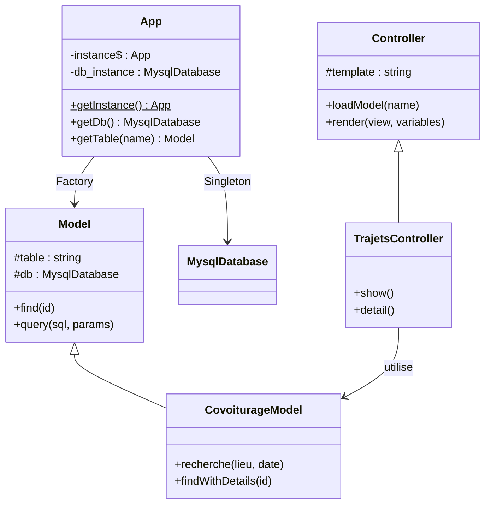
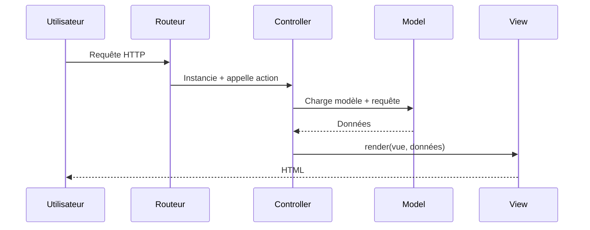

# EcoRide

🌿 **EcoRide : La Plateforme de Covoiturage Écologique**

## 💡 Aperçu du Projet
EcoRide est une startup française dédiée à la réduction de l'impact environnemental des déplacements. Notre plateforme web connecte conducteurs et passagers pour des trajets partagés, offrant une solution de transport économique et responsable. Le projet, initié par notre Directeur Technique José, se distingue par une approche technique "Vanilla" et une architecture MVC sur mesure.

## 🛠️ Stack Technique
Ce projet repose sur une architecture MVC (Modèle-Vue-Contrôleur), sans framework commercial lourd, pour une performance et une maîtrise du code.

| Composant | Technologie | Détails |
| :--- | :--- | :--- |
| **Back-end** | PHP 8.0+ | Architecture MVC. Routage procédural via `public/index.php`. <br>Admin Route: `?p=admin.index` (Gestion Utilisateurs). |
| **Front-end** | JavaScript & CSS (Vanilla) | Pas de framework JS/CSS (React, Vue, Tailwind, Bootstrap). Responsive Design natif (Mobile First, Grid Layout, Flexbox). |
| **Base de Données** | MySQL 5.7+ | Connexion via PDO. |
| **Gestion de Dépendances** | Composer | Utilisé pour l'autoloading (PSR-4) et `PHPMailer`. |
| **Tests** | PHPUnit | Tests unitaires pour la logique métier critique. |

## 🧠 Justification des Choix Techniques

Pourquoi avoir choisi cette stack "Vanilla" et une architecture sur mesure plutôt que d'utiliser des frameworks populaires (Symfony, Laravel, React, etc.) ?

### 1. Architecture MVC
*   **Maîtrise & Pédagogie** : Construire son propre framework MVC permet de comprendre en profondeur les mécanismes sous-jacents des frameworks modernes (Routeur, Contrôleur Frontal, Injection de Dépendances).
*   **Légereté** : L'application n'embarque que le strict nécessaire, garantissant des performances optimales sans le "bloat" de fonctionnalités inutilisées.

### 2. PHP Natif (Sans ORM lourd)
*   **Performance** : L'utilisation directe de PDO offre des performances brutes supérieures et une consommation mémoire réduite par rapport à des ORM comme Doctrine ou Eloquent.
*   **Contrôle SQL** : Cela force à écrire et optimiser ses propres requêtes SQL, une compétence essentielle pour tout développeur Backend.

### 3. JavaScript Vanilla (Sans Framework JS)
*   **Rapidité d'Exécution** : Pas d'étape de compilation (transpilation) ni de gros bundle JS à charger. Le code est interprété directement par le navigateur.
*   **Simplicité de Maintenance** : Aucune dépendance NPM complexe à gérer ou à mettre à jour pour le frontend. Tout est standard et pérenne.

### 4. Approche "No-Magic"
*   **Débogage Facilité** : En l'absence de "magie" (autowiring complexe, annotations, etc.), le flux de l'application est explicite et plus facile à suivre en cas de bug.
*   **Sécurité Explicite** : La gestion manuelle de la sécurité (échappement des sorties, validation des entrées) oblige à une rigueur accrue et une meilleure conscience des vecteurs d'attaque (XSS, Injection SQL).

## 🚀 Fonctionnalités Clés & Implémentation
EcoRide propose un ensemble complet de fonctionnalités pour gérer le covoiturage, du point de vue conducteur et passager.

### 🚗 Pour les Conducteurs
*   **Publication de Trajet (US9)** : Création de trajets avec gestion de crédits (coût de 2 crédits par publication).
    *   *Logique* : Vérification du solde de crédits avant publication. Statut initial "Prévu".
*   **Gestion du Cycle de Vie (US11)** :
    *   **Démarrer** : Passage du statut à "En cours".
    *   **Terminer** : Passage à "Terminé", déclenchant l'envoi d'emails de validation aux passagers.
    *   **Annuler** : Annulation avec remboursement automatique des crédits et notification.
*   **Historique Conducteur (US10)** : Vue dédiée des trajets passés effectués en tant que conducteur.

### 🚶 Pour les Passagers
*   **Recherche Avancée (US1)** : Moteur de recherche multicritères (Départ, Arrivée, Date).
    *   *Filtres* : Énergie (Éco/Std), Prix, Durée, Note du conducteur.
    *   *Expérience Utilisateur* : Mise à jour instantanée des résultats via **AJAX** (sans rechargement de page) lors de la modification des filtres.
    *   *Écologique* : Badge vert pour les véhicules électriques.
*   **Réservation (US11)** :
    *   *Transaction* : Déduction immédiate des crédits du passager.
    *   *Validation* : Après le trajet, le passager valide si tout s'est "bien passé" pour déclencher le paiement du conducteur.
*   **Historique Passager (US10)** : Vue séparée des trajets effectués en tant que passager.

### 📱 Responsive Design (US14)
*   **Mobile (< 600px)** : Navigation via Burger Menu, mise en page colonne unique.
*   **Tablette (600px - 992px)** : Layout 2 colonnes (Sidebar + Contenu) pour le tableau de bord.
*   **Desktop (> 992px)** :
    *   Grille de résultats de recherche (Grid Layout) pour une meilleure lisibilité.
    *   Sidebar de navigation profil persistante.
    *   Conteneur principal limité à 1200px pour les grands écrans.

### 👤 Gestion de Compte & Transverse
*   **Authentification (US6/7)** : Connexion sécurisée via **Pseudo** (anciennement email), Inscription avec choix de pseudo unique.
    *   *Rôles* : Visiteur, Passager, Chauffeur, Administrateur, Employé.
*   **Profil & Préférences (US8)** : Gestion des informations personnelles, préférences de voyage (Fumeur, Animaux, Musique) et gestion du parc automobile (US8 addendum).
    *   *Suspension* : Les utilisateurs suspendus voient un avertissement et ne peuvent ni modifier leur profil, ni gérer leurs véhicules ou trajets.
*   **Administration & Employés (US12/13)** :
    *   **Employés** : Modération des avis utilisateurs (Validation/Refus) et signalement des incidents.
    *   **Administrateurs** : Gestion complète des employés et des utilisateurs (Suspension/Réactivation).
    *   **Tableau de Bord** : Visualisation dynamique des performances via graphiques interactifs (Covoiturages/Jour et Crédits/Jour) utilisant Chart.js.
    *   **Sessions Indépendantes** : Les sessions Admin (`$_SESSION['auth_admin']`) et Employé (`$_SESSION['auth_employe']`) sont gérées indépendamment, permettant à un utilisateur d'être connecté en tant qu'admin et employé simultanément depuis le même navigateur. La déconnexion d'un rôle n'affecte pas l'autre.

## 📊 Espace Administration & Reporting

L'interface d'administration offre une vue d'ensemble de l'activité de la plateforme grâce à un tableau de bord interactif.

### Tableau de Bord (Dashboard)
Le dashboard administrateur (`admin/dashboard.php`) intègre deux visualisations clés pour le suivi des performances, propulsées par **Chart.js**.

#### 1. Graphique des Covoiturages
- **Type** : Histogramme (Bar Chart).
- **Données** : Nombre de covoiturages publiés par jour sur les 30 derniers jours.
- **Objectif** : Suivre l'adoption du service et les pics d'activité (ex: départs en vacances).
- **Implémentation** : 
    - Données agrégées par `EmployeModel::recupererCovoituragesParJour()`.
    - Injection JSON directe dans la vue.

#### 2. Graphique des Crédits
- **Type** : Courbe (Line Chart).
- **Données** : Cumul des crédits générés par la plateforme par jour (2 crédits par trajet publié).
- **Objectif** : Monitorer la "santé économique" de la plateforme (crédits = revenus virtuels).
- **Implémentation** :
    - Données calculées via `EmployeModel::recupererCreditsParJour()`.
    - Rendu visuel avec lissage de courbe pour identifier les tendances.

#### 3. Données de Test (Seeding)
Pour tester ces graphiques, un script est disponible pour générer des données aléatoires :
- **Fichier** : `tests/seed_covoiturages.php`
- **Usage** : Exécuter `php tests/seed_covoiturages.php` à la racine du projet.
- **Action** : Insère des covoiturages fictifs sur les 10 derniers jours.

### Moderation
Les administrateurs et employés disposent d'outils pour maintenir la qualité du service :
- **Suspension de Compte** : Désactivation immédiate d'un utilisateur, l'empêchant de se connecter. Un email de notification est envoyé automatiquement.
- **Validation des Avis** : Les avis laissés par les passagers sont en attente de modération. L'équipe peut les valider (publier) ou les refuser (supprimer), garantissant des retours constructifs.

## ⚙️ Installation et Configuration

### 1. Prérequis
*   Serveur Web (Apache/Nginx)
*   PHP 8.0+
*   MySQL 5.7+
*   Composer

### 2. Base de Données
Exécutez les scripts SQL situés dans le dossier (racine ou `scripts_DB` selon structure) :
1.  **Création** : `CREATE DATABASE ecoride_db;`
2.  **Schéma** : Importez `DDL.sql` (ou `MCD.sql` selon disponibilité).
3.  **Données** : Importez `DML.sql` pour les données de test.
4.  **Configuration** : Mettez à jour `config/config.php` (ou équivalent dans `App.php`) avec vos identifiants.

**Attention :** Pour pouvoir vous connecter à l'interface d'administration, vous devez insérer les données suivantes dans la table `employe` :
```sql
INSERT INTO `employe` (nom, prenom, email, password, date_embauche, salaire, id_poste, id_dept, id_manager, pseudo) VALUES
('Admin', 'Admin', 'admin@mail.com', 'erAdmin51', '2019-09-01',65000, 1, 2, NULL, 'Admin51'), 	-- manager
('Durand', 'Sophie', 'sophie.durand@mail.com', 'erSophie21', '2021-03-10', 42000, 2, 2, 1, 'Sophie21'); -- Employe rattachés au manager
```
Confer point 3.

### 3. Installation
```bash
git clone https://github.com/votre-repo/ecoride.git
cd ecoride
composer install # Installe PHPMailer et génère l'autoloader
```

### 4. Lancement
Placez le projet dans votre racine web (ex: `htdocs`) et accédez à :
`http://localhost/ecoride/public/index.php`

**Accès directs :**
- **Utilisateur** : `EcoRide/public/index.php?p=utilisateurs.login`
- **Administrateur** : `EcoRide/public/index.php?p=admin.employes.login`

## 🏗️ Structure du Projet

```
ecoride/
├── app/                        # Cœur de l'application (MVC)
│   ├── Controller/             # Contrôleurs (Logique métier)
│   │   ├── CovoituragesController.php
│   │   ├── TrajetsController.php
│   │   ├── UtilisateursController.php
│   │   └── Admin/              # Contrôleurs Back-office
│   ├── Model/                  # Modèles (Accès Données)
│   │   ├── CovoiturageModel.php
│   │   ├── UtilisateurModel.php
│   │   └── ...
│   └── Views/                  # Vues (HTML/PHP)
│       ├── covoiturages/
│       ├── trajets/
│       ├── utilisateurs/
│       └── ...
├── core/                       # Framework Custom
│   ├── Auth/DbAuth.php         # Authentification
│   ├── HTML/MyForm.php         # Générateur de Formulaire
│   └── Database/               # Gestion BDD
├── public/                     # Racine Web
│   ├── index.php               # Routeur & Point d'entrée
│   ├── css/                    # Styles CSS
│   ├── js/                     # Scripts JS
│   └── assets/                 # Images
├── tests/                      # Tests Unitaires (PHPUnit)
│   └── Unit/
├── vendor/                     # Librairies Composer
└── README.md                   # Documentation Projet
```

## 🏛️ Architecture MVC Détaillée

EcoRide implémente le pattern **MVC (Model-View-Controller)** , un pattern architectural qui sépare l'application en 3 couches distinctes.

### Schéma du Pattern MVC

```
┌─────────────────┐
│   UTILISATEUR   │
└────────┬────────┘
        │ Requête HTTP
        ▼
┌─────────────────┐
│ public/index.php│  ← Routeur (Point d'entrée)
└────────┬────────┘
        │
        ▼
┌─────────────────┐
│   CONTROLLER    │  ← Logique métier (app/Controller/)
└─▲──┬──────┬──▲──┘
  │  │      │  │ Action de l'utilisateur
  │  ▼      ▼  │
┌───────┐  ┌───────┐
│ MODEL │  │  VIEW │
└───────┘  └───────┘
Notification
(Données)  (Affichage)
```

### Les 3 Composants

| Composant | Dossier | Rôle | Classe de Base |
| :--- | :--- | :--- | :--- |
| **Model** | `app/Model/` | Accès aux données, logique métier | `core/Model/Table.php` |
| **View** | `app/Views/` | Affichage HTML | Templates PHP |
| **Controller** | `app/Controller/` | Orchestration, traitement requêtes | `core/Controller/Controller.php` |

### Flux d'une Requête (Exemple)

```
1. GET http://localhost/ecoride/public/index.php?p=trajets.show

2. index.php parse "trajets.show"
   └── Instancie TrajetsController
   └── Appelle méthode show()

3. TrajetsController::show()
   └── $this->loadModel('Covoiturage')  // Factory
   └── $trajets = $this->Covoiturage->recherche(...)
   └── $this->render('trajets.trajet', compact('trajets'))

4. Vue trajets/trajet.php
   └── Affiche les $trajets en HTML

5. Réponse HTML → Utilisateur
```

### Fichiers Clés de l'architecture MVC

| Fichier | Rôle |
| :--- | :--- |
| `public/index.php` | **Routeur** - Point d'entrée, analyse `?p=controller.action` |
| `core/Controller/Controller.php` | **Base Controller** - `loadModel()`, `render()` |
| `core/Model/Model.php` | **Base Model** - CRUD générique (`find()`, `query()`) |
| `app/App.php` | **Conteneur** - Singleton + Factory pour l'injection DB |

### Diagrammes UML

#### Diagramme de Classes


#### Diagramme de Séquence - Flux MVC


## 🤝 Contribution
1.  Forkez le projet.
2.  Créez votre branche (`git checkout -b feature/NouvelleFonctionnalite`).
3.  Committez vos changements (`git commit -m 'Ajout d'une nouvelle fonctionnalité'`).
4.  Poussez vers la branche (`git push origin feature/NouvelleFonctionnalite`).
5.  Ouvrez une Pull Request.

## 💻 Section Technique & Logique Frontend

Cette section détaille les mécanismes techniques clés utilisés pour l'interactivité côté client.

### 1. Pont de Données PHP ➔ JavaScript
Dans `app/Views/admin/dashboard.php`, nous utilisons la fonction native PHP `json_encode()` pour transférer des données complexes (tableaux associatifs) du Backend vers le Frontend.
*   **Logique** : PHP génère le HTML. Au sein de la balise `<script>`, il injecte les données PHP converties en format JSON (JavaScript Object Notation).
*   **Exemple** : `var donneesCovoiturages = <?= json_encode($covoiturages); ?>;` permet au script JS externe d'utiliser les données récupérées par le contrôleur sans appel AJAX supplémentaire.

### 2. Gestion des Scripts (`public/js/`)

#### a. Graphiques (`script_graphiques-admin.js`)
Ce fichier gère la visualisation des données via la librairie **Chart.js**.
*   **`new Chart(ctx, configuration)`** : Instancie un nouveau graphique sur un élément `<canvas>`.
*   Les données injectées via le dashboard (voir point 1) sont mappées (`.map()`) pour extraire les labels (dates) et les valeurs (nombres).
*   **Configuration** : `maintainAspectRatio: false` est utilisé pour permettre le redimensionnement personnalisé du conteneur CSS.

#### b. Inscription & AJAX (`script_inscription.js`)
Ce script améliore l'expérience utilisateur (UX) en validant les données en temps réel.
*   **Événement `blur`** : Se déclenche lorsque le champ perd le focus (l'utilisateur "sort" du champ).
*   **AJAX (`fetch`)** : Envoie une requête asynchrone au serveur (`index.php?p=utilisateurs.verificationUnique...`) pour vérifier si le pseudo ou l'email existe déjà.
*   **Réponse** : Le serveur renvoie un JSON (`{unique: true/false}`), permettant au JS d'afficher un message d'erreur instantané sans recharger la page.

### 3. Concepts JavaScript Importants

#### Le Callback dans `addEventListener`
Vous verrez souvent cette structure :
```javascript
document.addEventListener('DOMContentLoaded', function() {
    // ... code ...
});
```
*   **Pourquoi une fonction en paramètre ?** : C'est une **fonction de rappel** (callback). Elle n'est pas exécutée immédiatement, mais passée à la méthode `addEventListener`.
*   **Logique** : La méthode attend que l'événement 'DOMContentLoaded' survienne (signifiant que tout le HTML est chargé et prêt). Une fois l'événement détecté, elle "rappelle" (exécute) notre fonction. Cela garantit que notre script ne tente pas de manipuler des éléments HTML qui n'existent pas encore.

## 🎯 Design Patterns : Le Singleton

EcoRide utilise le **pattern Singleton** pour gérer l'instance unique de l'application et sa connexion à la base de données.

### Qu'est-ce que le Singleton ?
C'est un **design pattern de création** qui garantit qu'une classe n'a **qu'une seule instance** et fournit un point d'accès global à cette instance.

### Implémentation dans `app/App.php`

```php
class App
{
    /** @var App|null Instance unique de l'application */
    private static $instance;
    
    /** @var MysqlDatabase|null Connexion DB */
    private $db_instance;

    /**
     * Retourne l'instance unique (Singleton).
     */
    public static function getInstance()
    {
        if (is_null(self::$instance)) {
            self::$instance = new App();
        }
        return self::$instance;
    }
}
```

### Utilisation dans le Projet

| Méthode | Description | Exemple |
| :--- | :--- | :--- |
| `App::getInstance()->getDb()` | Récupère la connexion MySQL unique | `$db = \App::getInstance()->getDb();` |
| `App::getInstance()->getTable('Nom')` | Instancie un modèle avec injection DB | `$userModel = \App::getInstance()->getTable('Utilisateur');` |

### Avantages
-   **Connexion DB unique** : Une seule connexion MySQL pour toute l'application.
-   **Point d'accès global** : Accès facile depuis n'importe où via `App::getInstance()`.
-   **Lazy Loading** : L'instance est créée uniquement au premier appel.

### Le Pattern Factory (Usine de Modèles)

La méthode `getTable()` de la classe `App` implémente le pattern **Factory** pour créer des instances de modèles.

#### Qu'est-ce que le Factory ?
C'est un **design pattern de création** qui fournit une interface pour créer des objets sans spécifier leur classe concrète.

#### Implémentation dans `app/App.php`

```php
public function getTable($name)
{
    $class_name = 'NsAppEcoride\\Model\\' . $name . 'Model';
    return new $class_name($this->getDb());
}
```

#### Utilisation

```php
// Création dynamique d'un modèle avec injection DB
$userModel = \App::getInstance()->getTable('Utilisateur');
$covoitModel = \App::getInstance()->getTable('Covoiturage');

// Dans un contrôleur via loadModel()
$this->loadModel('Utilisateur');
```

#### Avantages
-   **Injection de dépendance** : Chaque modèle reçoit automatiquement la connexion DB.
-   **Centralisation** : Un seul point de création pour tous les modèles.
-   **Convention de nommage** : Pattern `{Nom}Model` appliqué automatiquement.

## 🔒 Sécurité & Protection des Données

EcoRide intègre plusieurs mécanismes de sécurité pour protéger les utilisateurs et l'application.

### 1. Sécurisation de l'Inscription (US7)
*   **Validation Côté Client (JS)** :
    *   Vérification du format de l'adresse email.
    *   Confirmation de l'adresse email (double saisie).
    *   **Complexité du Mot de Passe** : Impose au moins 8 caractères, une majuscule, une minuscule et un chiffre.
*   **Validation Côté Serveur** :
    *   **Normalisation** : Conversion de l'email en minuscules et suppression des espaces superflus avant enregistrement.
    *   **Tests Unitaires** : La logique de validation est couverte par `tests/Unit/UtilisateurInscriptionTest.php`.

### 2. Protection XSS (Cross-Site Scripting)
Toutes les données affichées dans les vues sont échappées via la fonction native `htmlspecialchars()`.
*   *Exemple* : `app/Views/utilisateurs/profile/index.php`
    ```php
    <p>Bienvenue, <?php echo htmlspecialchars($utilisateur->pseudo ?? ''); ?> !</p>
    ```

### 3. Protection Clickjacking
L'application interdit son chargement dans une `<iframe>` externe pour prévenir les attaques de détournement de clic.
*   **Implémentation** : En-tête HTTP `X-Frame-Options: DENY` ajouté dans `public/index.php`.

### 4. Gestion de la Suspension (UI)
Les utilisateurs suspendus voient leur interface restreinte visuellement et fonctionnellement.
*   **Logique de Vue** : Les boutons d'action sont désactivés si l'utilisateur est suspendu.
    ```php
    <?php if ($is_suspended): ?> 
        <button class="btn btn-secondary btn-suspended" disabled>Modifier</button> 
    <?php endif; ?>
    ```

### 5. Protection de la Vie Privée (Data Masking)
*   **Masquage par défaut** : L'adresse email est masquée (`j***n@email.com`) sur le profil pour éviter l'exposition involontaire (shoulder surfing). Un bouton "Regarder" permet de la révéler à la demande via JavaScript.
*   **Validation des Entrées** : Le champ téléphone n'accepte que des caractères numériques (`pattern="[0-9]+"`) pour garantir l'intégrité des données.

## 📧 Contact
Pour toute question, contactez l'équipe technique EcoRide.
