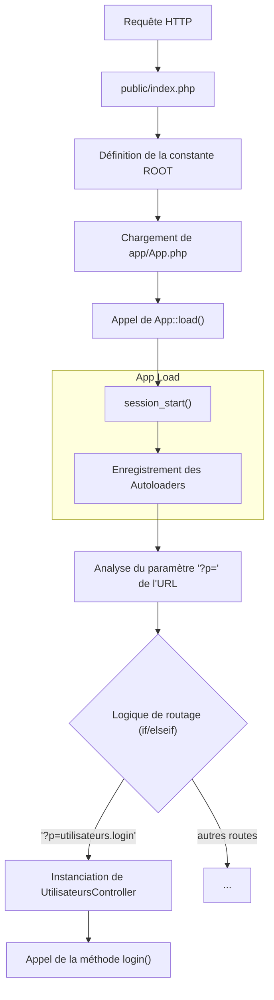
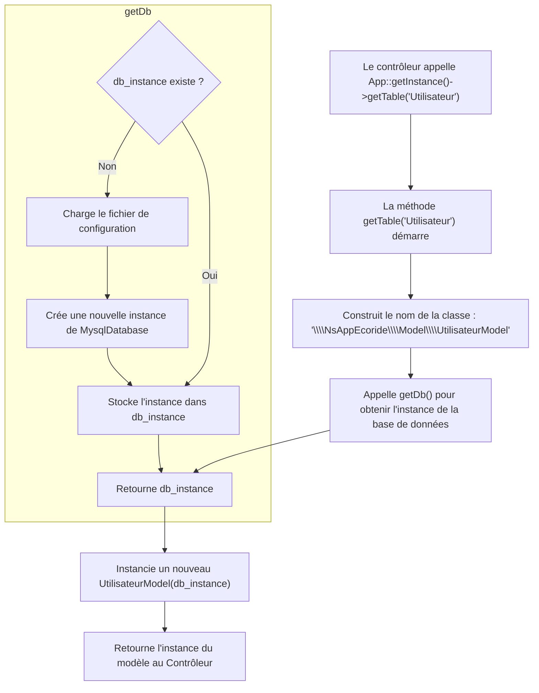
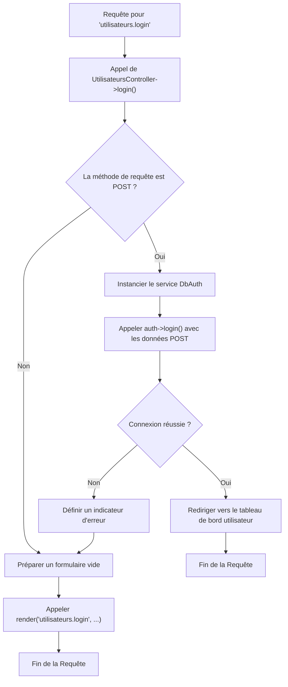
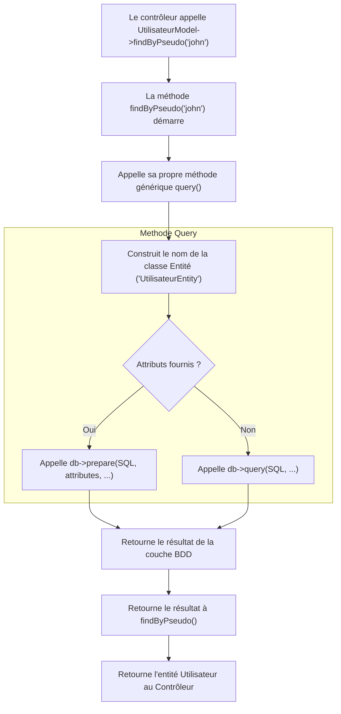
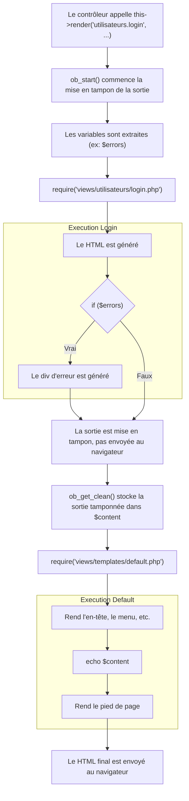
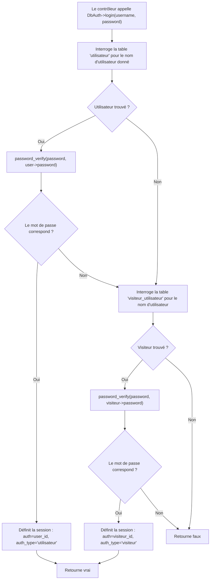

# Choix Explication Flux Back-End.md

Ce document analyse l'architecture MVC (Modèle-Vue-Contrôleur) PHP personnalisée du projet EcoRide. Il extrait des segments de code clés de chaque couche de l'architecture pour expliquer leurs rôles et interactions.

---

## 1. Le Processus de Démarrage (Bootstrap) & Routage

L'application suit un modèle "Front Controller", où toutes les requêtes HTTP sont dirigées vers un point d'entrée unique : `public/index.php`. Ce fichier est responsable de l'initialisation de l'application et du routage de la requête vers le contrôleur approprié.

### 1.1. Justification de l'Extraction

`index.php` est le fichier le plus critique pour comprendre le cycle de vie d'une requête. Il montre comment l'application démarre, comment les classes sont chargées, et comment un paramètre d'URL est traduit en une action de contrôleur spécifique. Ce mécanisme de routage simple, mais efficace, est le fondement de tout le framework.

### 1.2. Flux Schématique : Cycle de Vie d'une Requête



### 1.3. Code Source : `public/index.php`

```php
<?php
define('ROOT', dirname(__DIR__));
// Protection contre le Clickjacking
header('X-Frame-Options: DENY');
require(ROOT . '/app/App.php');
App::load();

if (isset($_GET['p'])) {
    $page = $_GET['p'];
} else {
    $page = 'home';
}

// Routeur simple basé sur le paramètre 'p'
// Exemple pour la connexion :
if ($page === 'utilisateurs.login') {
    $controller = new \NsAppEcoride\Controller\UtilisateursController();
    $controller->login();
} 
// Exemple pour le tableau de bord utilisateur :
elseif ($page === 'utilisateurs.index') {
    $controller = new \NsAppEcoride\Controller\UtilisateursController();
    $controller->index();
} 
// ... des dizaines d'autres conditions elseif pour toutes les autres routes
elseif ($page === 'home') {
    $controller = new \NsAppEcoride\Controller\CovoituragesController();
    $controller->index();
}
// ...
?>
```

---

## 2. Le Cœur de l'Application & Conteneur de Services

La classe `App` agit comme le cœur du framework. Elle utilise un pattern Singleton pour fournir un point d'accès unique et global aux services principaux, notamment la connexion à la base de données et les fabriques (factories) de modèles.

### 2.1. Justification de l'Extraction

`App.php` démontre comment l'application gère ses dépendances, un concept connu sous le nom de Conteneur de Services ou de Fabrique. La méthode `getTable()` est un exemple parfait d'un pattern factory, créant dynamiquement des instances de modèles tout en injectant la dépendance de base de données requise. C'est un aspect fondamental de l'architecture du projet, garantissant que les composants sont faiblement couplés et que la connexion à la base de données est gérée efficacement.

### 2.2. Flux Schématique : Fabrique de Modèles (`getTable()`)



### 2.3. Code Source : `app/App.php`

```php
<?php

use NsCoreEcoride\Config;
use NsCoreEcoride\Database\MysqlDatabase;

class App
{
    private static $_instance;
    private $db_instance;

    /**
     * Récupère l'instance unique de l'App (Pattern Singleton).
     */
    public static function getInstance()
    {
        if (is_null(self::$_instance)) {
            self::$_instance = new App();
        }
        return self::$_instance;
    }

    /**
     * Charge les composants essentiels comme la session et les autoloaders.
     */
    public static function load()
    {
        session_start();
        require ROOT . '/app/Autoloader.php';
        NsAppEcoride\Autoloader::register();
        require ROOT . '/core/Autoloader.php';
        NsCoreEcoride\Autoloader::register();
        // ...
    }

    /**
     * Méthode Factory pour obtenir une instance de Modèle.
     * @param string $name Le nom du modèle (ex: 'Utilisateur')
     * @return object Une instance du modèle demandé.
     */
    public function getTable($name)
    {
        $class_name = '\\NsAppEcoride\\Model\\' . ucfirst($name) . 'Model';
        // Injection de dépendance : l'instance de la BDD est passée au constructeur du modèle.
        return new $class_name($this->getDb());
    }

    /**
     * Récupère l'instance unique de la connexion à la base de données.
     */
    public function getDb()
    {
        $config = Config::getInstance(ROOT . '/config/config.php');
        if (is_null($this->db_instance)) {
            $this->db_instance = new MysqlDatabase(
                $config->get('db_name'), 
                $config->get('db_user'), 
                $config->get('db_pass'), 
                $config->get('db_host')
            );
        }
        return $this->db_instance;
    }
}
```

---

## 3. La Couche Contrôleur

Les contrôleurs sont les "chefs d'orchestre" de l'architecture MVC. Ils reçoivent les requêtes du routeur, interagissent avec les modèles nécessaires pour récupérer ou modifier des données, puis sélectionnent une vue pour rendre la réponse.

### 3.1. Justification de l'Extraction

La méthode `UtilisateursController::login()` est un exemple classique des responsabilités d'un contrôleur. Elle gère les entrées utilisateur (`$_POST`), utilise un service dédié `DbAuth` pour exécuter la logique métier (l'authentification), et prend une décision en fonction du résultat : soit une redirection vers le tableau de bord en cas de succès, soit un nouvel affichage du formulaire de connexion avec un message d'erreur en cas d'échec. La méthode de base `Controller::render()` est également extraite pour montrer la logique de rendu de vue principale.

### 3.2. Flux Schématique : Action `login()`



### 3.3. Code Source : `core/Controller/Controller.php` et `app/Controller/UtilisateursController.php`

**Contrôleur de Base :**
```php
<?php
namespace NsCoreEcoride\Controller;

class Controller
{
    protected $viewPath;
    protected $template;

    /**
     * Rend une vue à l'intérieur d'un template.
     * @param string $view Le fichier de vue à rendre.
     * @param array $variables Les variables à extraire pour la vue.
     */
    protected function render($view, $variables = [])
    {
        ob_start();
        extract($variables); // Rend les variables disponibles dans le fichier de vue
        
        // Rend le fichier de vue spécifique (ex: login.php)
        require($this->viewPath . str_replace('.', '/', $view) . '.php');
        
        $content = ob_get_clean(); // Capture la sortie
        
        // Rend le template principal (ex: default.php), qui utilisera $content
        require($this->viewPath . 'templates/' . $this->template . '.php');
    }
    // ... autres méthodes comme forbidden(), notFound()
}
```

**Action du Contrôleur Utilisateurs :**
```php
<?php
namespace NsAppEcoride\Controller;

use \NsCoreEcoride\Auth\DbAuth;
use \App;

class UtilisateursController extends AppController
{
    // ... constructeur et autres méthodes

    /**
     * Gère la page de connexion et le processus d'authentification.
     */
    public function login()
    {
        $errors = false;

        if (!empty($_POST)) {
            $auth = new DbAuth(App::getInstance()->getDb());

            if ($auth->login($_POST['pseudo'], $_POST['password'])) {
                header('Location: index.php?p=utilisateurs.index');
                exit;
            } else {
                $errors = true; // Définit l'indicateur d'erreur pour la vue
            }
        }

        // Rend la vue de connexion
        $this->render('utilisateurs.login', compact('errors'));
    }
    
    // ... autres actions comme logout(), inscrir(), etc.
}
```

---

## 4. La Couche Modèle

La couche Modèle est responsable de toute la logique liée aux données. Elle interagit directement avec la base de données pour récupérer, insérer, mettre à jour et supprimer des données. Chaque classe de modèle correspond généralement à une seule table de la base de données.

### 4.1. Justification de l'Extraction

La classe de base `Model` est cruciale car elle implémente la logique d'accès aux données de base et établit des conventions (comme la détermination automatique du nom de la table). La méthode `query()` montre comment elle abstrait la préparation et l'exécution spécifiques à la base de données des requêtes SQL. `UtilisateurModel` est extrait pour montrer comment un modèle concret étend cette classe de base pour fournir des méthodes spécifiques et lisibles comme `findByPseudo()`, encapsulant la logique SQL loin des contrôleurs.

### 4.2. Flux Schématique : Récupération de Données par le Modèle



### 4.3. Code Source : `core/Model/Model.php` et `app/Model/UtilisateurModel.php`

**Modèle de Base :**
```php
<?php
namespace NsCoreEcoride\Model;

use NsCoreEcoride\Database\Database;

class Model
{
    protected $table;
    protected $db;

    public function __construct(Database $db)
    {
        $this->db = $db;
        // Si la classe enfant ne définit pas de $table, on la devine à partir du nom de la classe.
        if (is_null($this->table)) {
            $part = explode('\\', get_class($this));
            $class_name = end($part);
            $this->table = strtolower(str_replace('Model', '', $class_name));
        }
    }

    /**
     * Méthode générique pour exécuter une requête SQL.
     * @return mixed Le résultat de la requête.
     */
    public function query($statement, $attributes = null, $one = false)
    {
        $classe_name = str_replace('Model', 'Entity', get_class($this));

        if ($attributes) {
            return $this->db->prepare($statement, $attributes, $classe_name, $one);
        } else {
            return $this->db->query($statement, $classe_name, $one);
        }
    }
    
    /**
     * Trouve un enregistrement unique par sa clé primaire.
     */
    public function find($id)
    {
        return $this->query("SELECT * FROM {$this->table} WHERE {$this->column} = ?", [$id], true);
    }
    
    // ... méthodes génériques update(), delete(), insert()
}
```

**Modèle Utilisateur :**
```php
<?php
namespace NsAppEcoride\Model;

use NsCoreEcoride\Model\Model;

class UtilisateurModel extends Model
{
    protected $table = 'utilisateur';
    protected $column = 'utilisateur_id';

    /**
     * Récupère un utilisateur par son pseudo.
     * @param string $pseudo
     * @return object|null Une entité utilisateur ou null.
     */
    public function findByPseudo($pseudo)
    {
        return $this->query(
            "SELECT * FROM utilisateur WHERE pseudo = ?",
            [$pseudo],
            true
        );
    }

    // ... beaucoup d'autres méthodes spécifiques comme isPseudoUnique(), getVoituresForUser(), etc.
}
```

---

## 5. La Couche Vue

La couche Vue est responsable de la présentation des données à l'utilisateur. Dans cette architecture, les vues sont des fichiers PHP qui contiennent du HTML mélangé à une logique PHP simple (boucles, conditions) pour afficher les variables passées par le contrôleur.

### 5.1. Justification de l'Extraction

La vue `login.php` est un exemple parfait de cette couche. C'est presque du HTML pur, mais elle utilise PHP pour afficher conditionnellement un message d'erreur (`<?php if ($errors): ?>`) en fonction d'une variable passée par le `UtilisateursController`. Cela démontre la séparation des préoccupations : la vue ne sait pas *pourquoi* il y a une erreur, elle sait seulement que si l'indicateur `$errors` est vrai, elle doit afficher le bloc d'erreur. Le processus de rendu est entièrement géré par la méthode `render()` du contrôleur de base.

### 5.2. Flux Schématique : Le Processus `render()`



### 5.3. Code Source : `app/Views/utilisateurs/login.php`

```php
<section class="presentation-section">
    <div class="presentation-content">
        <div class="login-box">
            <h1>Connexion</h1>
            
            <!-- Rendu conditionnel basé sur une variable du contrôleur -->
            <?php if ($errors): ?>
                <div class="alert alert-error">
                    <p>Identifiants invalides. Veuillez réessayer.</p>
                </div>
            <?php endif; ?>

            <!-- Le formulaire de connexion -->
            <form id="loginForm" method="POST" class="login-form">
                <div class="form-group">
                    <label for="pseudo">Pseudo</label>
                    <input
                        type="text"
                        id="pseudo"
                        name="pseudo"
                        class="form-control"
                        placeholder="Entrez votre pseudo"
                        required />
                </div>

                <div class="form-group">
                    <label for="password">Mot de passe</label>
                    <input
                        type="password"
                        id="password"
                        name="password"
                        class="form-control"
                        placeholder="Entrez votre mot de passe"
                        required />
                </div>

                <div class="form-buttons">
                    <button type="submit" class="btn btn-primary">Se connecter</button>
                    <!-- ... -->
                </div>
            </form>
            <!-- ... -->
        </div>
    </div>
</section>
```

---

## 6. Préoccupation Transversale : L'Authentification

L'authentification est une "préoccupation transversale" car sa logique est nécessaire dans de nombreuses parties de l'application. Ce projet encapsule correctement cette logique dans une classe de service dédiée, `DbAuth`, plutôt que de surcharger les contrôleurs.

### 6.1. Justification de l'Extraction

La méthode `DbAuth::login()` est la pièce centrale de la logique d'authentification. Elle est extraite car elle montre clairement le processus métier de la connexion :
1. Essayer de trouver un `utilisateur` correspondant.
2. Si trouvé, vérifier le mot de passe haché.
3. Si cela échoue, essayer de trouver un `visiteur` correspondant (un utilisateur pré-enregistré).
4. Si trouvé, vérifier son mot de passe.
5. En cas de succès à n'importe quelle étape, définir les variables de session appropriées (`$_SESSION['auth']` et `$_SESSION['auth_type']`).

Cela garde le contrôleur propre et la logique d'authentification réutilisable et testable.

### 6.2. Flux Schématique : Service d'Authentification `login()`



### 6.3. Code Source : `core/Auth/DbAuth.php`

```php
<?php
namespace NsCoreEcoride\Auth;

use NsCoreEcoride\Database\Database;

class DbAuth
{
    private $db;

    public function __construct(Database $db)
    {
        $this->db = $db;
    }

    public function login($username, $password)
    {
        // 1. Tente de se connecter en tant qu'utilisateur complet
        $user = $this->db->prepare("SELECT * FROM utilisateur WHERE pseudo = ?", [$username], null, true);

        if ($user) {
            if (password_verify($password, $user->password)) {
                $_SESSION['auth'] = $user->utilisateur_id;
                $_SESSION['auth_type'] = 'utilisateur';
                return true;
            }
        }

        // 2. Si la connexion de l'utilisateur échoue, tente de se connecter en tant que visiteur pré-enregistré
        $visiteur = $this->db->prepare("SELECT * FROM visiteur_utilisateur WHERE pseudo = ?", [$username], null, true);

        if ($visiteur) {
             if (password_verify($password, $visiteur->password)) {
                $_SESSION['auth'] = $visiteur->visiteur_utilisateur_id;
                $_SESSION['auth_type'] = 'visiteur';
                return true;
             }
        }

        return false;
    }
    
    public function isConnected()
    {
        return isset($_SESSION['auth']) && !empty($_SESSION['auth']);
    }
    
    // ... autres méthodes comme getConnectedUserId(), getAuthType(), isAdmin(), etc.
}
```
