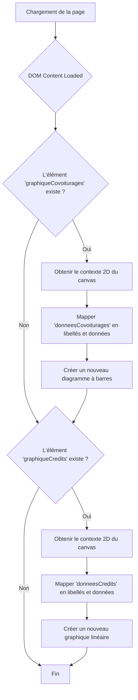
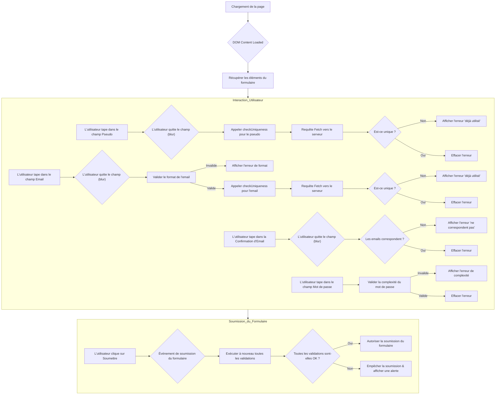
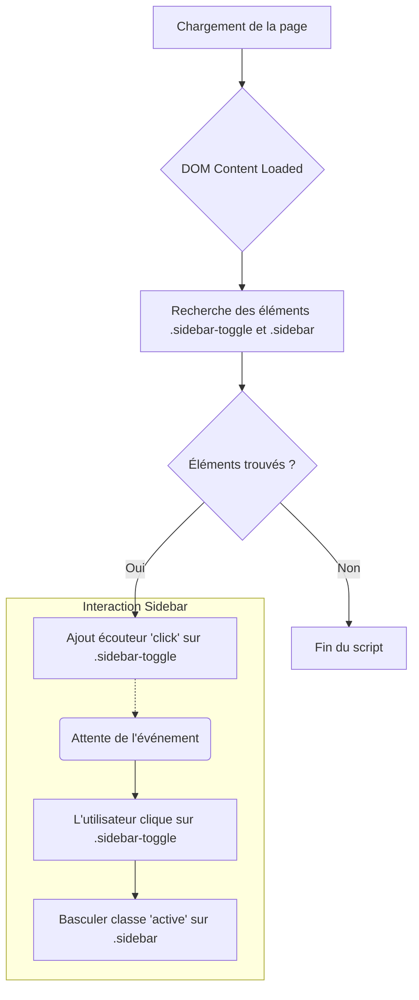
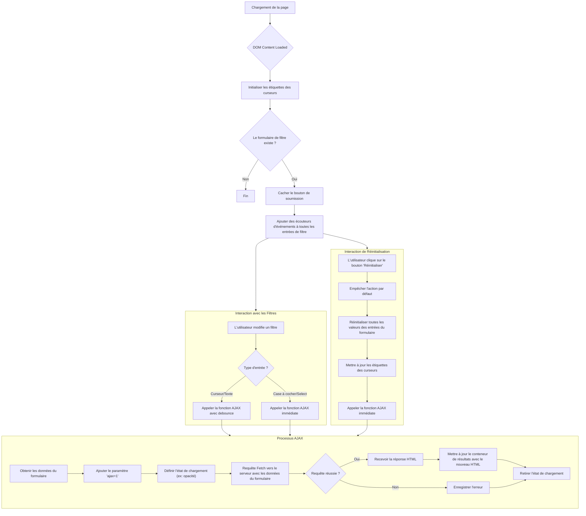
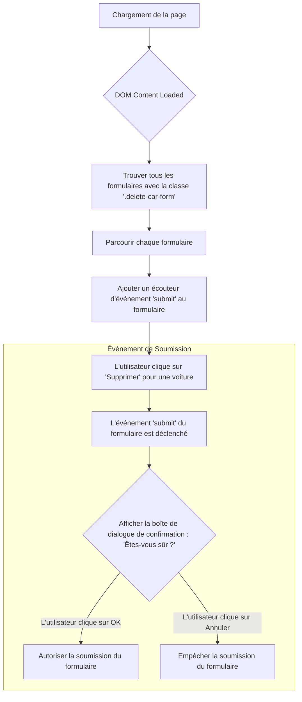

# Choix Explication Flux Front-End.md

Ce document fournit une explication détaillée du code JavaScript utilisé dans le projet EcoRide. Chaque section est dédiée à un script spécifique, décrivant son objectif, ses fonctionnalités, et fournissant le code source complet pour examen.

---

## 1. `script_graphiques-admin.js`

### 1.1. Objectif et Fonctionnalités

Ce script est responsable de l'initialisation et du rendu des graphiques sur le tableau de bord de l'administration. Il utilise la bibliothèque `Chart.js` pour créer deux types de graphiques : un diagramme à barres pour les statistiques de covoiturage et un graphique linéaire pour les gains de crédits.

Le script attend que le DOM soit entièrement chargé. Il vérifie ensuite l'existence de deux éléments canvas spécifiques : `graphiqueCovoiturages` et `graphiqueCredits`.

-   Si `graphiqueCovoiturages` est trouvé, il initialise un diagramme à barres en utilisant la variable globale `donneesCovoiturages` (qui est censée être fournie par le code PHP côté serveur).
-   Si `graphiqueCredits` est trouvé, il initialise un graphique linéaire en utilisant la variable globale `donneesCredits`.

Les deux graphiques sont configurés pour être responsifs et pour que l'axe Y commence à zéro.

### 1.2. Flux Schématique



### 1.3. Code Source

```javascript
// script_graphiques-admin.js

document.addEventListener("DOMContentLoaded", function () {
    // Graphique Covoiturages
    if (document.getElementById('graphiqueCovoiturages')) {
        const ctxCovoit = document.getElementById('graphiqueCovoiturages').getContext('2d');

        const labelsCovoit = donneesCovoiturages.map(item => item.date);
        const dataCovoit = donneesCovoiturages.map(item => item.total);

        new Chart(ctxCovoit, {
            type: 'bar',
            data: {
                labels: labelsCovoit,
                datasets: [{
                    label: 'Nombre de covoiturages',
                    data: dataCovoit,
                    backgroundColor: 'rgba(54, 162, 235, 0.2)',
                    borderColor: 'rgba(54, 162, 235, 1)',
                    borderWidth: 1
                }]
            },
            options: {
                responsive: true,
                maintainAspectRatio: false,
                scales: {
                    y: {
                        beginAtZero: true
                    }
                }
            }
        });
    }

    // Graphique Crédits
    if (document.getElementById('graphiqueCredits')) {
        const ctxCredits = document.getElementById('graphiqueCredits').getContext('2d');

        const labelsCredits = donneesCredits.map(item => item.date);
        const dataCredits = donneesCredits.map(item => item.total_credits);

        new Chart(ctxCredits, {
            type: 'line',
            data: {
                labels: labelsCredits,
                datasets: [{
                    label: 'Crédits gagnés',
                    data: dataCredits,
                    backgroundColor: 'rgba(75, 192, 192, 0.2)',
                    borderColor: 'rgba(75, 192, 192, 1)',
                    borderWidth: 1,
                    fill: true
                }]
            },
            options: {
                responsive: true,
                maintainAspectRatio: false,
                scales: {
                    y: {
                        beginAtZero: true
                    }
                }
            }
        });
    }
});
```

---

## 2. `script_inscription.js` 

### 2.1. Objectif et Fonctionnalités

Ce script gère la validation côté client pour le formulaire d'inscription des utilisateurs. Il fournit un retour en temps réel à l'utilisateur pour garantir l'intégrité des données avant la soumission. 

Les fonctionnalités principales sont :
-   **Vérification d'Unicité :** Il effectue une requête AJAX `fetch` vers un point de terminaison du serveur (`index.php?p=utilisateurs.verificationUnique`) pour vérifier si le `pseudo` et l' `email` choisis sont déjà utilisés. Cette vérification est déclenchée sur l'événement `blur` (lorsque l'utilisateur quitte le champ de saisie).
-   **Validation de Format :** Il valide le format de l'adresse e-mail et la complexité du mot de passe à l'aide d'expressions régulières.
-   **Vérification de Confirmation :** Il s'assure que les champs de l'e-mail et de la confirmation de l'e-mail correspondent.
-   **Contrôle de la Soumission du Formulaire :** Il intercepte l'événement `submit` du formulaire pour effectuer une dernière vérification de validation. Si une validation échoue, il empêche la soumission du formulaire et alerte l'utilisateur.

### 2.2. Flux Schématique



### 2.3. Code Source

```javascript
document.addEventListener('DOMContentLoaded', function() {
    const form = document.getElementById('registerForm');
    const pseudoInput = document.getElementById('pseudo');
    const emailInput = document.getElementById('email');
    const emailConfirmationInput = document.getElementById('emailConfirmation');
    const passwordInput = document.getElementById('password');

    const pseudoError = document.getElementById('pseudoError');
    const emailError = document.getElementById('emailError');
    const emailErrorConfirmation = document.getElementById('emailErrorConfirmation');
    const passwordError = document.getElementById('passwordError');

    // Fonction générique pour vérifier l'unicité via AJAX
    function checkUniqueness(field, value, errorElement) {
        if (!value) {
            errorElement.textContent = '';
            return;
        }

        fetch(`index.php?p=utilisateurs.verificationUnique&field=${field}&value=${encodeURIComponent(value)}`)
            .then(response => response.json())
            .then(data => {
                if (!data.unique) {
                    errorElement.textContent = `Ce ${field === 'pseudo' ? 'pseudo' : 'email'} est déjà utilisé.`;
                    errorElement.style.color = 'red';
                } else {
                    errorElement.textContent = '';
                }
            })
            .catch(err => {
                console.error('Erreur lors de la vérification:', err);
            });
    }

    // Fonctions de validation
    function validateEmail(email) {
        const regex = /^[a-zA-Z0-9._-]+@[a-zA-Z0-9.-]+\.[a-zA-Z]{2,6}$/;
        return regex.test(email);
    }

    function validatePassword(password) {
        // Au moins 8 caractères, 1 majuscule, 1 minuscule, 1 chiffre
        const regex = /^(?=.*[a-z])(?=.*[A-Z])(?=.*\d)[a-zA-Z\d]{8,}$/;
        return regex.test(password);
    }

    function checkEmail() {
        // Suppression des espaces
        emailInput.value = emailInput.value.trim();
        const value = emailInput.value;
        
        if (!value) {
           emailError.textContent = '';
           return false;
        }

        if (!validateEmail(value)) {
            emailError.textContent = "L'adresse email n'est pas valide (format attendu : nom@domaine.extension).";
            emailError.style.color = 'red';
            return false;
        } else {
            emailError.textContent = '';
            // Si le format est bon, on vérifie l'unicité
            checkUniqueness('email', value, emailError);
            return true;
        }
    }

    function checkEmailConfirmation() {
        emailConfirmationInput.value = emailConfirmationInput.value.trim();
        const email = emailInput.value;
        const confirmation = emailConfirmationInput.value;

        if (email !== confirmation) {
            emailErrorConfirmation.textContent = "Les adresses email ne correspondent pas.";
            emailErrorConfirmation.style.color = 'red';
            return false;
        } else {
            emailErrorConfirmation.textContent = '';
            return true;
        }
    }

    function checkPassword() {
        const value = passwordInput.value;
        if (!validatePassword(value)) {
            passwordError.textContent = "Le mot de passe doit contenir au moins 8 caractères, une majuscule, une minuscule et un chiffre.";
            passwordError.style.color = 'red';
            return false;
        } else {
            passwordError.textContent = '';
            return true;
        }
    }

    // Écouteurs d'événements
    if (pseudoInput) {
        pseudoInput.addEventListener('blur', function() {
            checkUniqueness('pseudo', this.value, pseudoError);
        });
    }

    if (emailInput) {
        emailInput.addEventListener('blur', checkEmail);
        emailInput.addEventListener('input', function() {
             // Nettoyer l'erreur de format pendant la frappe si l'utilisateur corrige, 
             // mais on ne valide complètement qu'au blur pour ne pas être agaçant
             if(emailError.textContent.includes("valide")) emailError.textContent = '';
        });
    }

    if (emailConfirmationInput) {
        // Vérifier la correspondance quand on quitte le champ de confirmation
        emailConfirmationInput.addEventListener('blur', checkEmailConfirmation);
    }
    
    if (passwordInput) {
        passwordInput.addEventListener('input', checkPassword);
    }

    // Interception de la soumission du formulaire
    if (form) {
        form.addEventListener('submit', function(e) {
            let valid = true;

            // On relance toutes les vérifications
            if (!checkEmail()) valid = false;
            
            // On vérifie la confirmation seulement si l'email est rempli
            if (emailInput.value && !checkEmailConfirmation()) valid = false;
            
            if (!checkPassword()) valid = false;
            
            // Si le pseudo est vide (géré par required, mais au cas où)
            if (!pseudoInput.value.trim()) valid = false;

            // Vérification des erreurs d'unicité affichées (si le serveur a répondu "déjà utilisé")
            if (pseudoError.textContent !== '' || emailError.textContent !== '') {
                valid = false;
            }

            if (!valid) {
                e.preventDefault(); // Empêcher l'envoi
                alert("Veuillez corriger les erreurs dans le formulaire avant de soumettre.");
            }
        });
    }
});
```

---

## 3. `script_menu.js` and `script_profile.js`

### 3.1. Objectif et Fonctionnalités

C'est un script simple pour gérer le menu "burger" responsif pour les vues mobiles.

Il ajoute un écouteur d'événement `click` à l'icône du burger. Lorsqu'on clique dessus, il bascule une classe `active` sur le menu de navigation (`.nav-menu`) et sur l'icône du burger elle-même. La classe `active` est utilisée dans le CSS pour contrôler la visibilité et l'animation du menu mobile.

### 3.2. Objectif et Fonctionnalités

Ce script est destiné à gérer les interactions sur la page de profil de l'utilisateur, spécifiquement pour basculer une barre latérale (sidebar) responsive.

Il recherche un élément `.sidebar-toggle` et un élément `.sidebar`. Si les deux sont trouvés, il ajoute un écouteur d'événement `click` au bouton de basculement. Lorsqu'on clique dessus, cela bascule une classe `active` sur la barre latérale, permettant au CSS de l'afficher ou de la cacher dans un contexte responsif.

Le script est très simple et semble être un placeholder ou une implémentation minimale pour de futures améliorations, comme indiqué par le commentaire à l'intérieur.

### 3.3. Flux Schématique



### 3.4. Code Source

```javascript
document.addEventListener('DOMContentLoaded', function () {
    // Gestion de la sidebar responsive (si nécessaire, pas explicitement demandé mais bon pour UX)
    const sidebarToggle = document.querySelector('.sidebar-toggle');
    const sidebar = document.querySelector('.sidebar');

    if (sidebarToggle && sidebar) {
        sidebarToggle.addEventListener('click', function () {
            sidebar.classList.toggle('active');
        });
    }

    // Gestion des onglets de la sidebar pour afficher les sections correspondantes
    // (Pourrait être une amélioration future, ici on garde le scroll ou l'affichage en bloc)
});
```

---

## 5. `script_trajet.js`

### 5.1. Objectif et Fonctionnalités

Ce script fournit des capacités de filtrage avancées pour la page de recherche de trajets (`covoiturage`). Il améliore l'expérience utilisateur en mettant à jour les résultats de recherche en temps réel via AJAX à mesure que l'utilisateur interagit avec les filtres.

Fonctionnalités clés :
-   **Affichage de la Valeur des Sliders :** Il met à jour les étiquettes de texte à côté des curseurs de plage (`prix_min`, `prix_max`, etc.) lorsque l'utilisateur les déplace.
-   **Filtrage AJAX en Temps Réel :**
    -   Il cache le bouton "Appliquer" par défaut.
    -   Il capture les modifications de toutes les entrées de filtre (curseurs, cases à cocher, champs de texte).
    -   Pour éviter des requêtes serveur excessives, il utilise une fonction `debounce` pour les curseurs et les champs de texte, attendant 300 ms après que l'utilisateur a cessé de taper/glisser avant d'envoyer la requête.
    -   Il envoie les données du formulaire au serveur via une requête AJAX `fetch` (POST), en incluant un paramètre `ajax=1` pour signaler un appel AJAX au contrôleur.
    -   La réponse HTML du serveur est ensuite injectée directement dans le conteneur de résultats (`#liste-resultats`).
-   **Fonctionnalité de Réinitialisation :** Il surcharge le comportement par défaut du bouton "Réinitialiser" pour effacer toutes les valeurs de filtre, mettre à jour les étiquettes des curseurs et déclencher une nouvelle recherche AJAX avec les valeurs par défaut.

### 5.2. Flux Schématique



### 5.3. Code Source

```javascript
// Script pour mettre à jour les valeurs affichées des sliders de filtres et gérer l'AJAX
(function () {
  var sliders = [
    {
      id: "prix_min",
      label: "label-prix-min",
      suffix: "€",
    },
    {
      id: "prix_max",
      label: "label-prix-max",
      suffix: "€",
    },
    {
      id: "duree_max",
      label: "label-duree",
      suffix: "h",
    },
    {
      id: "score_min",
      label: "label-score",
      suffix: "★",
    },
  ];

  document.addEventListener("DOMContentLoaded", function () {
    // Initialiser les labels des sliders
    sliders.forEach(function (s) {
      var input = document.getElementById(s.id);
      var label = document.getElementById(s.label);
      if (!input || !label) return;
      var update = function () {
        label.textContent = input.value;
      };
      input.addEventListener("input", update); // Mettre à jour le label en temps réel
      update();
    });

    // --- LOGIQUE AJAX ---
    var filterForm = document.getElementById("form-filters");
    if (filterForm) {
      var resultsContainer = document.getElementById("liste-resultats");
      var submitButton = filterForm.querySelector('button[type="submit"]');

      // Cacher le bouton "Appliquer" car on met à jour en temps réel
      if (submitButton) {
        submitButton.style.display = "none";
      }

      // Fonction Debounce pour limiter les appels AJAX
      function debounce(func, wait) {
        var timeout;
        return function () {
          var context = this;
          var args = arguments;
          clearTimeout(timeout);
          timeout = setTimeout(function () {
            func.apply(context, args);
          }, wait);
        };
      }

      // Fonction pour envoyer la requête AJAX
      var fetchResults = function () {
        var formData = new FormData(filterForm);
        formData.append("ajax", "1"); // Indiquer au contrôleur que c'est une requête AJAX

        // Ajouter une classe de chargement optionnelle
        if (resultsContainer) {
          resultsContainer.style.opacity = "0.5";
        }

        fetch(filterForm.action, {
          method: "POST",
          body: formData,
        })
          .then(function (response) {
            if (!response.ok) {
              throw new Error("Erreur réseau");
            }
            return response.text();
          })
          .then(function (html) {
            if (resultsContainer) {
              resultsContainer.innerHTML = html;
              resultsContainer.style.opacity = "1";
            }
          })
          .catch(function (error) {
            console.error("Erreur:", error);
            if (resultsContainer) {
              resultsContainer.style.opacity = "1";
            }
          });
      };

      // Version debouncée pour les inputs (sliders)
      var debouncedFetch = debounce(fetchResults, 300);

      // Ajouter les écouteurs d'événements
      var inputs = filterForm.querySelectorAll("input, select");
      inputs.forEach(function (input) {
        if (input.type === "range" || input.type === "text") {
          input.addEventListener("input", debouncedFetch);
        } else if (input.type === "checkbox" || input.type === "radio" || input.tagName === "SELECT") {
          input.addEventListener("change", fetchResults); // Pas besoin de debounce pour checkbox/select
        }
      });

      // Gestion du bouton Réinitialiser
      var resetButton = document.querySelector(".btn-reset");
      if (resetButton) {
        resetButton.addEventListener("click", function (e) {
          e.preventDefault();

          // Réinitialiser les valeurs (code existant + trigger AJAX)
          document.getElementById("prix_min").value = "0";
          document.getElementById("prix_max").value = "50";
          document.getElementById("duree_max").value = "20";
          document.getElementById("score_min").value = "4";

          var checkboxes = filterForm.querySelectorAll('input[type="checkbox"]');
          checkboxes.forEach(function (checkbox) {
            checkbox.checked = false;
          });

          // Mettre à jour les labels
          sliders.forEach(function (s) {
            var label = document.getElementById(s.label);
            if (label) {
              var input = document.getElementById(s.id);
              label.textContent = input.value;
            }
          });

          // Lancer la recherche AJAX avec les valeurs réinitialisées
          fetchResults();
        });
      }
    }
  });
})();
```

---

## 6. `script_voiture.js`

### 6.1. Objectif et Fonctionnalités

C'est un script de confirmation simple utilisé sur la page où un utilisateur gère ses voitures. Son but est d'empêcher la suppression accidentelle d'un véhicule.

Il trouve tous les formulaires avec la classe `.delete-car-form` et leur attache un écouteur d'événement `submit`. Lorsque l'utilisateur essaie de soumettre l'un de ces formulaires (c'est-à-dire en cliquant sur un bouton "Supprimer"), il affiche une boîte de dialogue native du navigateur `confirm()`.

-   Si l'utilisateur clique sur "OK" (`true`), la soumission du formulaire se poursuit normalement.
-   Si l'utilisateur clique sur "Annuler" (`false`), `e.preventDefault()` est appelé, ce qui empêche la soumission du formulaire.

### 6.2. Flux Schématique



### 6.3. Code Source

```javascript
document.addEventListener('DOMContentLoaded', function() {
    const deleteForms = document.querySelectorAll('.delete-car-form');
    
    deleteForms.forEach(form => {
        form.addEventListener('submit', function(e) {
            if (!confirm('Êtes-vous sûr de vouloir supprimer cette voiture ?')) {
                e.preventDefault();
            }
        });
    });
});
```
