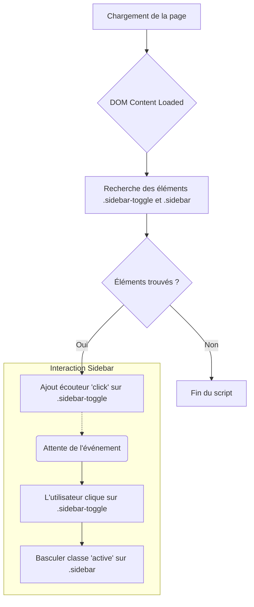

# Analyse de `script_profile.js`

## 1. Objectif et Fonctionnalités

Ce script est destiné à gérer les interactions sur la page de profil de l'utilisateur, spécifiquement pour basculer une barre latérale (sidebar) responsive.

Il recherche un élément `.sidebar-toggle` et un élément `.sidebar`. Si les deux sont trouvés, il ajoute un écouteur d'événement `click` au bouton de basculement. Lorsqu'on clique dessus, cela bascule une classe `active` sur la barre latérale, permettant au CSS de l'afficher ou de la cacher dans un contexte responsif.

## 2. Flux Schématique



## 3. Code Source

```javascript
document.addEventListener('DOMContentLoaded', function () {
    // Gestion de la sidebar responsive (si nécessaire, pas explicitement demandé mais bon pour UX)
    const sidebarToggle = document.querySelector('.sidebar-toggle');
    const sidebar = document.querySelector('.sidebar');

    if (sidebarToggle && sidebar) {
        sidebarToggle.addEventListener('click', function () {
            sidebar.classList.toggle('active');
        });
    }

    // Gestion des onglets de la sidebar pour afficher les sections correspondantes
    // (Pourrait être une amélioration future, ici on garde le scroll ou l'affichage en bloc)
});
```
